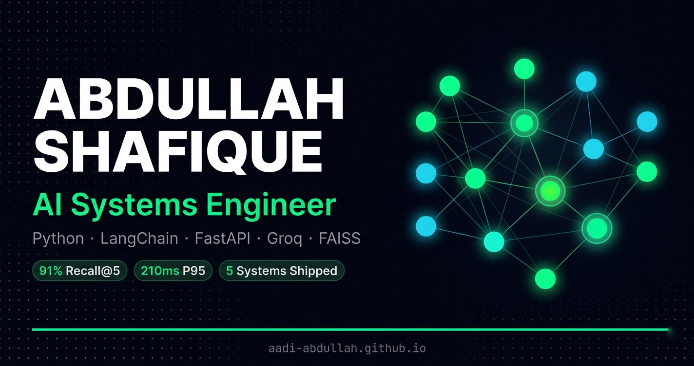

# 🧠 Abdullah Shafique — AI Systems Engineer

> AI Engineer building autonomous agents, RAG pipelines, and LLM-powered applications. Every system ships with evaluation metrics, failure handling, and real performance data — no demos without numbers.

**Built by [Abdullah Shafique](https://www.linkedin.com/in/aadi-abdullah)**  
AI Engineer · LangChain · Groq · FastAPI · Python

[](https://aadi-abdullah.github.io)
&nbsp;
[](https://github.com/aadi-abdullah)
&nbsp;
[](https://www.linkedin.com/in/aadi-abdullah)

---

## Overview

6 years designing for humans. Now building AI that works for them.

This is my personal portfolio — a production-aware showcase of AI systems I've built, with real metrics on every project. The site itself is built with Three.js WebGL shaders, Lenis smooth scroll, and a modular vanilla JS architecture. No frameworks, no build step, zero dependencies beyond CDN scripts.

---

## Live Projects

| # | Project | Live Demo | Stack |
|---|---------|-----------|-------|
| 01 | AI Research Agent | [aadi-research-agent.streamlit.app](https://aadi-research-agent.streamlit.app) | LangChain · Groq · Tavily · Streamlit |
| 02 | PDF Knowledge Assistant | [pdf-knowledge-assistant.vercel.app](https://pdf-knowledge-assistant.vercel.app) | FastAPI · React · FAISS · Groq |
| 03 | House Price Prediction API | [GitHub](https://github.com/aadi-abdullah/house-price-prediction-api) | FastAPI · XGBoost · Docker |
| 04 | LLM Evaluation Framework | [GitHub](https://github.com/aadi-abdullah/llm-eval-framework) | ROUGE · BERTScore · GitHub Actions |
| 05 | Agent Monitoring Dashboard | [GitHub](https://github.com/aadi-abdullah/agent-monitor) | FastAPI · HTMX · SQLite |

---

## Key Metrics

| Metric | Value |
|--------|-------|
| Retrieval Recall@5 | 91% (220 test queries) |
| P95 API Latency | 210ms |
| Agent Task Completion | 89% (100 test queries) |
| Hallucination Rate | 7% (grounded check) |
| Documents Indexed | 8k (largest RAG corpus) |

---

## How The Site Works

```
Browser loads index.html
        │
        ▼
[Three.js r128]  ──  WebGL shader neural network (1 draw call, ~130 nodes)
        │
        ▼
[Lenis v1.0.42]  ──  Smooth scroll (duration 0.72, no CSS scroll-behavior conflict)
        │
        ▼
[cursor.js]      ──  Custom cursor + particle trail (left/top RAF loop)
        │
        ▼
[scene.js]       ──  GLSL vertex + fragment shaders, scroll-reactive rotation
        │
        ▼
[tilt.js]        ──  RAF-throttled 3D card tilt + glossy CSS radial-gradient
        │
        ▼
[github.js]      ──  Stars, forks, contribution heatmap, language chart (XHR + localStorage cache)
        │
        ▼
[terminal.js]    ──  "Now building" widget with real GitHub commit messages
        │
        ▼
[main.js]        ──  Bootstrap: Lenis, typewriter, scroll reveal, count-up, copy email
```

---

## File Structure

```
aadi-abdullah.github.io/
│
├── index.html              # Main page — all sections
├── 404.html                # Custom 404 with Three.js network
├── robots.txt
├── sitemap.xml
├── README.md
│
├── css/
│   └── style.css           # Design tokens, layout, animations, responsive
│
├── js/
│   ├── cursor.js           # Custom cursor + particle trail (IIFE)
│   ├── scene.js            # Three.js WebGL shader neural network (IIFE)
│   ├── tilt.js             # RAF-throttled 3D card tilt + gloss (IIFE)
│   ├── github.js           # GitHub API: stars, forks, heatmap, lang chart (IIFE)
│   ├── terminal.js         # "Now building" terminal widget (IIFE)
│   └── main.js             # Bootstrap: Lenis, typewriter, scroll, reveal (IIFE)
│
└── assets/
    ├── og.jpg              # 1200×630 OG image for social previews
    ├── headshot.jpg        # Profile photo (circular crop in About section)
    └── favicon.png         # Browser tab icon (optional)
```

---

## Tech Stack

| Layer | Technology |
|-------|-----------|
| 3D Background | Three.js r128 — WebGL shader neural network |
| Smooth Scroll | Lenis v1.0.42 |
| Typography | Bebas Neue · JetBrains Mono · Plus Jakarta Sans |
| Hosting | GitHub Pages |
| No build step | Pure HTML / CSS / Vanilla JS |

---

## Local Setup

No installation required — open directly in a browser.

```bash
# Option 1 — VS Code Live Server (recommended)
# Install Live Server extension → right-click index.html → Open with Live Server

# Option 2 — Python
python -m http.server 8080
# → http://localhost:8080

# Option 3 — Node
npx serve .
# → http://localhost:3000
```

---

## Deploy to GitHub Pages

```bash
# First time setup
cd C:\Users\ABDULLAH\Downloads\aadi-abdullah.github.io

git init
git remote add origin https://github.com/aadi-abdullah/aadi-abdullah.github.io.git
git add .
git commit -m "feat: portfolio — Three.js WebGL shaders, Lenis, modular JS"
git push -u origin main
```

Go to **GitHub → Repo → Settings → Pages → Source: main / root**

Live at **https://aadi-abdullah.github.io** within ~60 seconds. Every push to `main` auto-deploys.

---

## Features

- **Three.js WebGL shaders** — custom GLSL vertex + fragment shaders, 1 draw call for all nodes
- **Scroll-reactive 3D scene** — neural network rotates with scroll position and mouse parallax
- **Custom cursor + particle trail** — GPU-composited, RAF-driven, disabled on touch devices
- **Lenis smooth scroll** — duration 0.72, no double-easing conflict with CSS
- **3D card tilt** — RAF-throttled, glossy reflection via CSS `--gx/--gy` custom properties
- **Typewriter hero** — cycles through lines with erase animation, `prefers-reduced-motion` guard
- **GitHub live stats** — stars, forks, 90-day contribution heatmap, language breakdown chart
- **localStorage cache** — 5-minute TTL on GitHub API responses, skeleton loading
- **Terminal widget** — shows real recent commit messages from GitHub events API
- **Scroll reveal** — IntersectionObserver, threshold 0.06
- **Count-up stats** — cubic ease-out animation on scroll into view
- **Focus trap** — mobile menu traps Tab/Shift-Tab correctly
- **Easter egg** — click the Three.js canvas for an amber node pulse
- **Print styles** — hides all JS/canvas elements, shows clean text layout
- **Custom 404** — full Three.js network on the error page

---

## Customisation Checklist

- [ ] Add `assets/headshot.jpg` → update `.avatar` in `style.css` with `background: url('../assets/headshot.jpg') center/cover`
- [ ] Add `assets/og.jpg` (1200×630px) → social preview image for LinkedIn/Twitter
- [ ] Create `cal.com/aadi-abdullah` account → set up 30-min event
- [ ] Replace placeholder testimonials in the Proof section with real LinkedIn recommendations
- [ ] Update `resume.pdf` in repo root whenever CV changes

---

## About the Author

I'm an AI Engineer with a background in design — I spent 6 years as a professional graphic designer before transitioning into software engineering. That background shapes how I build: I optimise for systems that are both technically sound and genuinely usable.

- 🎓 Software Engineering — Riphah International University (GPA 3.99 / 4.0, 2024–2028)
- 🏅 AI Agent Developer Specialization — Vanderbilt University
- 🏅 Microsoft Python Development Specialization
- 🏅 Adobe Graphic Designer Specialization

**Currently open to AI engineering internships and junior roles.**

→ [LinkedIn](https://www.linkedin.com/in/aadi-abdullah) · [GitHub](https://github.com/aadi-abdullah) · abdullahshafique2019@gmail.com

---

## License

MIT — free to use, modify, and distribute.